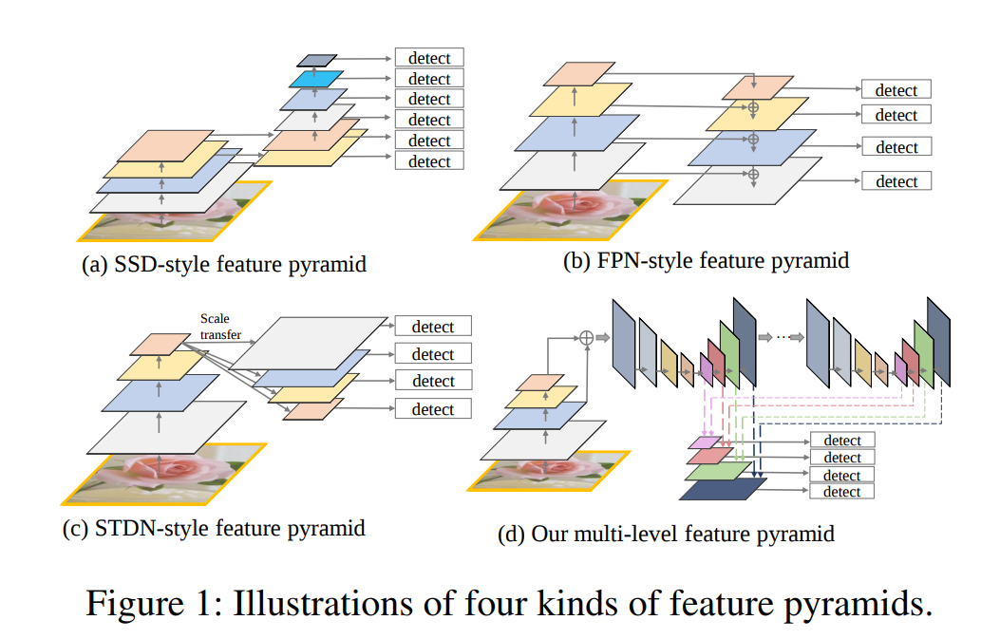
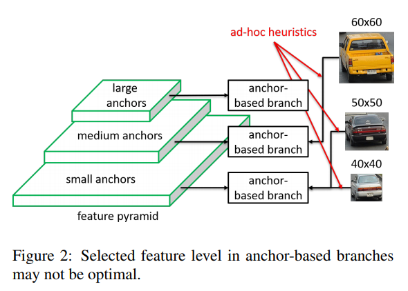
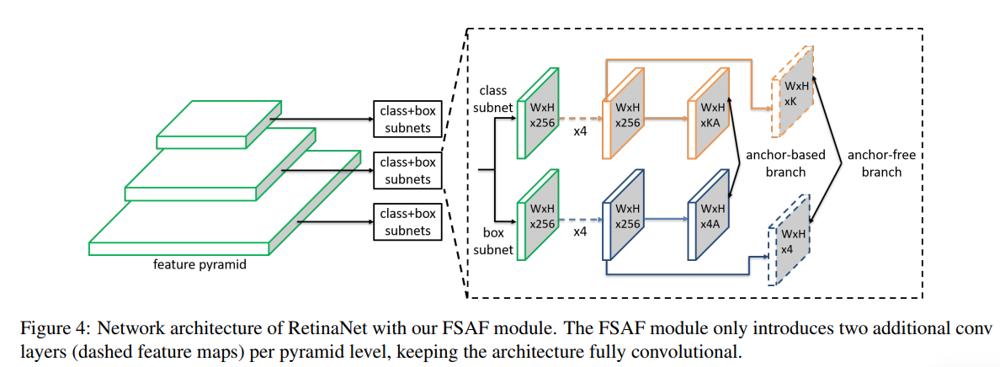
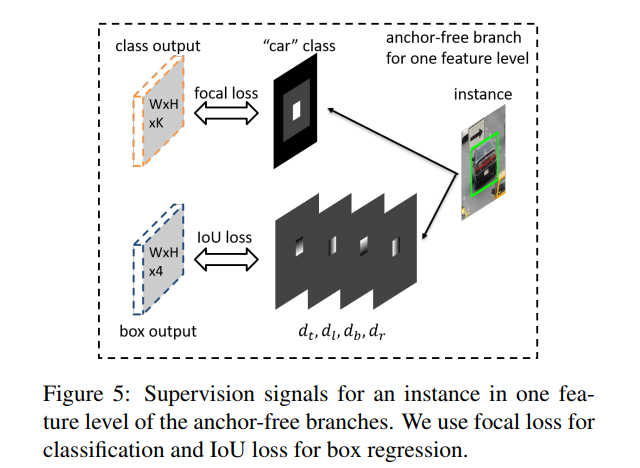
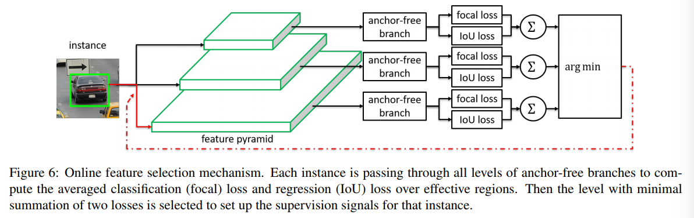

## 最新目标检测算法总结

1、《M2Det:A Single-Shot Object Detector based on Multi-Level Feature Pyramid Network》

提出了一种应对目标尺度变化的方法，类似于Hourglass的结构，中间层的信息融合。

2、《Feature Selective Anchor-Free Module for Single-Shot Object Detection》

之前设计的这些金字塔网络结构，主要是基于一个思想，就是说底层的特征更加适合小目标的检测，而顶层的特征对大目标检测更有效。但是这样的思路存在的问题是：**人工指导的特征选择**和**基于IoU的anchor采样**。例如，如图2，同样是汽车，但是大小不同，大的车就被分到了高级的语义层，而小的车却被分到了低级的特征层。这意味这我们的特征层的选择不一定是最优化的。那么我们怎样可以做到不只是基于box大小来选择特征层，而是基于语义信息来选择特征层。

**Network Architecture on RetinaNet**

可以看出之前的anchor-based 的输出尺寸是W\*H\*KA，其中K代表的是类别，而A代表的是anchor的数量，而Anchor-free的输出是W\*H\*K。

**Ground-truth and loss**

如图3、白色区域指的是有效区域，即目标存在于这个位置，全部标记为1；灰色区域表示忽视区域，即我们不在这些位置求反向传播，它的梯度是0；黑色区域是无目标出现的区域，标记为0。即，在 instance 的 0.2 倍 box 内为 positive，提供的标签即为“车”这个 class id；在 0.5 倍 box 内进行忽略；其他都设为负。而 regression output 只针对于 0.2 倍的 instance box 进行训练，回归像素点（i，j）离边界的距离，如下图所示：

**Online Feature Selection**

特征选择的过程如图4，我们将图像特征分别经过多个尺度的feature pyramid，分类和回归分支分别用focal loss和IoU loss两个损失的和来选一个最小损失的特征层。

3、《UnitBox: An Advanced Object Detection Network》2016

在DenseBox中，bounding box的定位使用的是l2损失。l2损失的一个缺点是会使模型在训练过程中更偏向于尺寸更大的物体，因为大尺寸物体的l2损失更容易大于小物体。

这里预测的偏差是当前像素点和gt_bbox的上下左右边界的偏差，和anchor based的方法预测的是anchor和gt_box的偏差有差别。

IoU Loss损失的前向传播

这里反向传播的公式推导也很容易理解，
$$
\frac{\partial \mathcal{L}}{\partial x_{t}}=\frac{\partial}{\partial x_{t}}(-\ln (I o U)) \\
=-\frac{1}{I o U} \frac{\partial}{\partial x_{t}}\left(I_{O} U\right) \\
=\frac{1}{I o U} \frac{I \times \frac{\partial U}{\partial x_{t}}-U \times \frac{\partial I}{\partial x_{t}}}{U^{2}} \\
=\frac{I \times \frac{\partial}{x_{t}}(X+\tilde{X}-I)-U \times \frac{\partial I}{\partial x_{t}}}{U^{2} I o U} \\
\begin{aligned} &=\frac{I \times\left(\frac{\partial}{x_{t}} X-\frac{\partial}{\partial x_{t}} I\right)-U \times \frac{\partial I}{\partial x_{t}}}{U^{2} I o U} \\ &=\frac{1}{U} \frac{\partial X}{x_{t}}-\frac{U+I}{U I} \frac{\partial I}{x_{t}} \end{aligned}
$$
其中，
$$
\frac{\partial X}{x_{t}}=x_{l}+x_{r}
$$

$$
\frac{\partial I}{x_{t}}=\left\{\begin{array}{ll}{I_{w},} & {\text { if } x_{t}<\tilde{x}_{t}\left(\text { or } x_{b}<\tilde{x}_{b}\right)} \\ {0,} & {\text { otherwise }}\end{array}\right.
$$

1. 损失函数和  成正比，因此预测的面积越大，损失越多；
2. 同时损失函数和  成反比，因此我们希望交集尽可能的大；
3. 综合1，2两条我们可以看出当bounding box等于ground truth值时检测效果最好。

[1]、https://arxiv.org/abs/1608.01471

[2]、https://zhuanlan.zhihu.com/p/44323675

4、《Generalized Intersection over Union: A Metric and A Loss for Bounding Box Regression》

要将IoU设计为损失，主要存在两个问题：

- 预测值和Ground truth没有重叠的话，IoU始终为0且无法优化
- IoU无法辨别不同方式的对齐，比如方向不一致等。这种情况下IoU的值并不能真实地反映出连个对象是如何重叠的。

注意这里的最小外接convex C就是将两个区域A,B包围的最小外接矩形。我们求的GIoU就是先求出C中没有包含A和B的区域占C面积的比值，再用IoU减去这个比值。
$$
\mathcal{L}_{GI o U}=1-GIoU
$$
[1]、https://arxiv.org/abs/1902.09630

5、《Region Proposal by Guided Anchoring》

如图，GA-RPN共包含三个部分：

- Anchor位置预测：接了sigmid激活函数，生成一个w*h大小的概率图，每个点代表的是是否存在目标。

- Anchor形状预测：直接预测w,h的大小，会导致训练的不稳定，因为其数值范围太大了，所以就做了一个映射，预测的是dw和dh。
  $$
  w=\sigma \cdot s \cdot e^{d w}, \quad h=\sigma \cdot s \cdot e^{d h}
  $$
  这个非线性映射将输出空间从大概[0, 1000]映射到了[-1, 1]之间，其中
  $$
  \sigma
  $$
  是经验尺度因数(实验中使用的是8)， s是strides。

- Anchor特征适应：由于不同的点的anchor大小形状均不相同，所以特征的表达应该也不一致，具体地，大的anchor，应该有更大的region的信息，而小的anchor，则需要对应region的信息。实现上，论文借用了deformable卷积的思想。新的特征图由原来的特征图做deformable卷积得到，其中offset由形状预测图卷积得到。通过这样的操作，达到了让 feature 的有效范围和 anchor 形状更加接近的目的，同一个 conv 的不同位置也可以代表不同形状大小的 anchor 了。

[1]、https://arxiv.org/pdf/1901.03278.pdf

6、《RePr: Improved Training of Convolutional Filters》

Motivation:卷积神经网络中有些参数权重是多余，那我们训练的时候把他们丢弃（pruning），接着训练剩下的网络，为了不损失模型的capacity，然后再把丢弃的参数拿回来，效果是不是会好一点。

训练过程如下：先训练整个网络，根据metric drop掉30%的filter，再训练剩下的网络，再把drop的filter拿回来。迭代这个过程N次。那么如何设计这个metric用来选出需要drop的filters呢？一个layer的多个卷积核可以用一个matrix表示，也就是  ,先对  归一化，再与自己的转置相乘得到  ,这是一个  x  大小的matrix，第i行表示其他filter对第i个filter的projection，可以看成是相关性，如果是正交性的越大，那么这个值就越小，一行的数值之和越小，说明其他filter与这个filter相关性越低。因此可以通过这个sum来对filter进行rank。

[1]、https://arxiv.org/abs/1811.07275

[2]、https://zhuanlan.zhihu.com/p/58095683