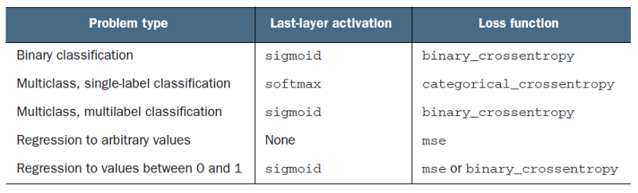

1、常用激活函数和损失函数总结



2、pytorch中的钩子（register_hook()，register_forward_hook()，register_backward_hook()）如何使用?

pytorch会自动舍弃中间变量，钩子使用结束后应及时删除。

```python
def hook(module, input, output):
    print(output.data)

handle = net.fc1.register_forward_hook(hook)
net(img)
handle.remove()
```

3、np.where()

用法1：

```python
np.where(conditions, x, y)
# if conditions is True: is x; else: is y
```

用法2：

```python
np.where(conditions)
# return the coordinates.
```

